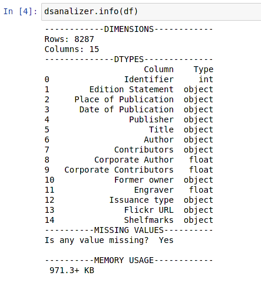

# Data Analizer
## created by Paweł Perenc

<!-- TABLE OF CONTENTS -->
<details open="open">
  <summary>Table of Contents</summary>
  <ol>
    <li>
      <a href="#about-the-project">About The Project</a>
      <ul>
        <li><a href="#built-with">Built With</a></li>
        <li><a href="#installation">Installation</a></li>
      </ul>
    </li>
    <li><a href="#license">License</a></li>
    <li><a href="#contact">Contact</a></li>
  </ol>
</details>


<!-- ABOUT THE PROJECT -->
## About The Project
I made this library to help speed up the initial data processing. Its task is to quickly and clearly present the data structure and to approximate possible problems that will have to be solved.

  PyPI link : 
  ```sh
  https://test.pypi.org/project/dsanalizer/
  ```

<!-- Image about -->
<p align="center">
    
</p>

### Built With

* [NumPy](https://numpy.org/)
* [Pandas](https://pandas.pydata.org/)
* [Python](https://www.python.org/)

### Installation

  ```sh
  pip install -i https://test.pypi.org/simple/ dsanalizer
  ```

<!-- LICENSE -->
## License

Distributed under the MIT License.

<!-- CONTACT -->
## Contact
[![LinkedIn][linkedin-shield]][linkedin-url]

<!-- MARKDOWN LINKS & IMAGES -->
<!-- https://www.markdownguide.org/basic-syntax/#reference-style-links -->
[linkedin-shield]: https://img.shields.io/badge/-LinkedIn-black.svg?style=for-the-badge&logo=linkedin&colorB=555
[linkedin-url]: https://www.linkedin.com/in/pawe%C5%82-perenc-51b39315a/
